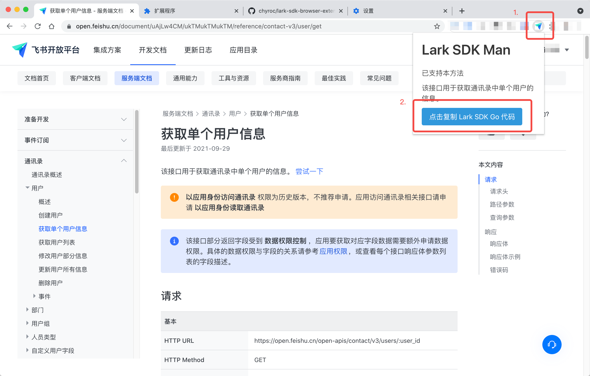

# lark-sdk-browser-extension
Lark SDK Browser Extension is used to help you find which SDK method you should use

SDK: https://github.com/chyroc/lark

## Install

1. Click Release Link
   
https://github.com/chyroc/lark-sdk-browser-extension/tags

2. Download The Latest ZIP File

3. Use Chrome to Load unzip dir
